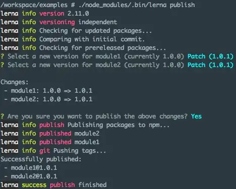
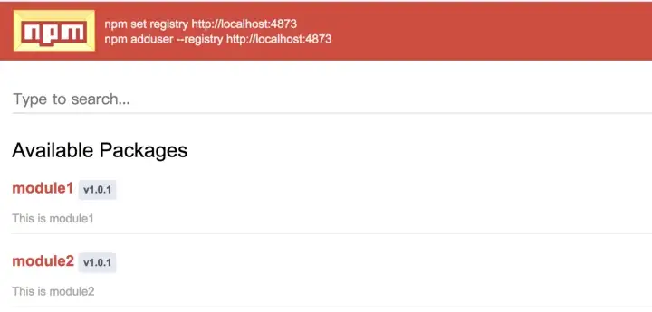

# Lerna Tutorial

Lerna is a tool for managing JavaScript projects with multiple packages. Sometime, in a large code base system, we need to split the code into the different modules or packages due to code sharing or single responsibility. However, it’s quite hard to mange a big project when develop, testing or even release.

So Lerna focuses on handling the mono-repo management and help you to construct a mono-repo project easily, link the dependency between different modules and release on NPM.

In the next couple of articles, we will learn Lerna by example. Before that let’s understand the running mode of Lerna firstly:
Fixed/Locked mode

This is default mode but not very usual to use. This mode need to maintain a single package version in lerna.json and this version will be operated on every packages. The most famous case is Babel.
Independent mode

In this mode, each version of packages is separated and allow developer to choose version to release when publishing. To enable this mode, you are supposed to assign version property as independent in lerna.json file or add--independent argument when running lerna init command.

When I started to play with Lerna, I realize it’s noisy that you have to publish some fake packages to NPM and have a git repository on GitHub or the other public git host to see what’s going on. Anyway, you can configure your npm packages and git repository as private but just need a few money. So I decide to create an independent environment built by Docker so that you can test Lerna within a private environment.

Please check lerna-tutorial-example.

lerna-tutorial-example gives you three docker containers:

    1. npmserver: It’s a npm server built by verdaccio
    2. gitserver: Git server which already contains a bare repository
    3. workspace: You will clone a dummy project and do all of the Lerna testing here!

Because gitserver only rely on SSH protocol for git connection, before start setup, please make sure you have a SSH key in your local machine. You can follow below commands to generate it if you don’t have:
```sh
$ cd ~
$ mkdir .ssh
$ cd .ssh
$ ssh-keygen -t rsa
```

It’s time to see how to use Lerna in docker:

```sh
$ git clone https://github.com/AllenFang/lerna-tutorial-example.git
```
#### Setup SSH

Copy your local SSH key to gitserver :

```sh
$ cd lerna-tutorial-example
$ cp ~/.ssh/id_rsa.pub ./docker/git-server/keys
$ cp ~/.ssh/id_rsa ./docker/git-server/keys
```
#### Start Docker

All the docker configs are placed in docker dir, lerna-tutorial-example use docker compose to construct the different services, so just follow below commands to start docker compose services:

```sh
$ cd docker
$ docker-compose up -d
```
After above commands, npmserver and gitserver containers will be started in the background mode. Next, we are going to launch to workspace container and setup a Lerna project for testing, You can execute below command to launch workspace everytime:

```sh
$ docker-compose run workspace sh
```
When you launch workspace, there’re few steps you need to setup in workspace container:
Setup NPM

```bash
$ npm set registry http://npmserver:4873
$ npm adduser --registry http://npmserver:4873  # key in your username, password and email
```
After finishing above two commands, you can open browser and do login via http://localhost:4873. After login, you will see no any package published yet. So there’re still two steps you need to do as below:
#### Setup Git

```sh
$ git config --global user.email "you@example.com"
$ git config --global user.name "Your Name"
```
#### Setup Dummy Project

Still in the workspace container, you can clone a Lerna project(called: examples) from remote git:
```sh
$ git clone ssh://git@gitserver/git-server/repos/examples.git
$ cd examples
$ npm install
```
    examples is a Lerna project with independent mode and have two different NPM modules: module1 and module2.

#### Lerna Testing

After above three main steps in workspace container, right now you can try to publish this Lerna project to the NPM by:

```sh
$ ./node_modules/.bin/lerna publish
```
You will see a Lerna prompt for each package that has changed to specify if it’s a patch, minor, major or custom change.


After Lerna packages published, you are supposed to see above result which means module1 and module2 already published to NPM!! Then you can visit http://localhost:4873 to verify again:


In addition, you can find Lerna also help you to add a tag per module via git tag command.
#### Conclusion

In this article, we introduce lerna-tutorial-example which allow you to play with Lerna in an independent environments. In the next post, I share some quick tips and common questions about Lerna, feel free to check: 5 tips about lerna

source :
https://medium.com/shopback-tech-blog/lerna-tutorial-series-brief-f77f40c5777f