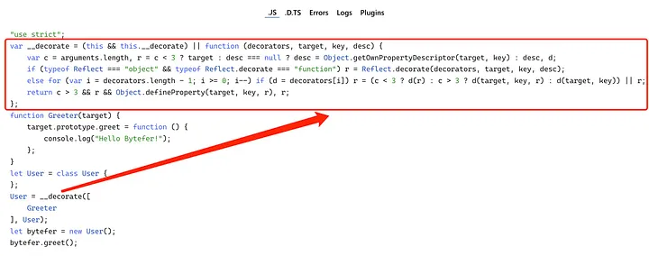

Welcome to the Mastering TypeScript series. This series will introduce the core knowledge and techniques of TypeScript in the form of animations. Let’s learn together! 

If you’ve used Angular or Nest.js, you should be familiar with decorators.

```typescript
import { Controller, Get } from '@nestjs/common';

@Controller('cats')
export class CatsController {
  @Get()
  findAll(): string {
    return 'This action returns all cats';
  }
}

```

In the above code @XXXis syntactic sugar, to enable experimental decorators feature you must enable experimentalDecorators compiler option on command line or in tsconfig.json file.

```json
{
  "compilerOptions": {
     "target": "es2016",
     "experimentalDecorators": true
   }
}

```

There are four main types of decorators:

####  Class Decorator
#### Property Decorator
####  Method Decorator
####  Parameter Decorator

Next, I will introduce these 4 types of decorators separately.

# Class Decorator

Class decorators, as the name suggests, are used to decorating classes. The type corresponding to the class decorator is defined in the lib.es5.d.ts file:

```
// node_modules/typescript/lib/lib.es5.d.ts
declare type ClassDecorator = <TFunction extends Function>
  (target: TFunction) => TFunction | void;

```
As can be seen from the type definition of the class decorator, it receives a parameter representing the class to be decorated. According to the definition of class decorator, we can create a Greeter decorator to add a greet method to the decorated class:

```
// user.ts
function Greeter(target: Function): void {
  target.prototype.greet = function (): void {
    console.log("Hello Bytefer!");
  };
}

@Greeter
class User {}

let bytefer = new User();
(bytefer as any).greet();

```
When you successfully run the above code, the terminal will output the result — Hello Bytefer!. The class decorator looks pretty simple, but now comes the problem. What should we do if we want to customize the output of the greet method? To satisfy this functionality, we need to use the decorator factory.
Decorator Factory

The so-called decorator factory is to return the decorator after being called. Using the characteristics of higher-order functions, let’s update the Greeter function defined earlier:
```
function Greeter(msg: string) {
   return (target: Function): void => {
    target.prototype.greet = function (): void {
        console.log(msg);
    };
   }
}
```
After updating the Greeter decorator factory, we need to use it in the following way:
```
@Greeter("Hello TypeScript!")
class User {}

let bytefer = new User();
(bytefer as any).greet();
```
When you successfully run the above code, the terminal will output the result — Hello TypeScript!. It should be noted that we can use multiple class decorators for the same class. For example, in the following code, I added a Log class decorator:
```
function Log(target: Function): void {
  target.prototype.log = (msg: string) => {
    console.log(`From ${target.name}: `, msg);
  };
}

@Log
@Greeter("Hello TypeScript!")
class User {}

let bytefer = new User();
(bytefer as any).greet();
(bytefer as any).log("Hello Kakuqo!");
```
In the above code, we have added 2 decorators to the User class, after that, we can call greet and log methods on the User instance.
```
Hello TypeScript!
From User:  Hello Kakuqo!
```
# Property Decorator

Property decorators are used to decorating properties of classes. Its corresponding type declaration is as follows:
```
// node_modules/typescript/lib/lib.es5.d.ts
declare type PropertyDecorator = 
 (target: Object, propertyKey: string | symbol) => void;
```
The property decorator function takes 2 parameters: target and property. According to the definition of property decorator, Let’s define a property decorator logProperty to track user actions on a property.
```
function logProperty(target: any, key: string) {
  let value = target[key];

  const getter = function () {
    console.log(`Getter for ${key} returned ${value}`);
    return value;
  };

  const setter = function (newVal: any) {
    console.log(`Set ${key} to ${newVal}`);
    value = newVal;
  };

  // Replace the property
  if (delete target[key]) {
    Object.defineProperty(target, key, {
      get: getter,
      set: setter,
      enumerable: true,
      configurable: true,
    });
  }
}
```
Once we have the logProperty property decorator, we can apply it on the properties of the class. For example, I used the logProperty decorator on the nameproperty of the User class:
```
class User {
  @logProperty
  public name: string;

  constructor(name: string) {
    this.name = name;
  }
}

const user = new User("Bytefer");
user.name = "Kakuqo";
console.log(user.name);
```
When you successfully run the above code, the terminal will output the results:
```
Set name to Bytefer
Set name to Kakuqo
Getter for name returned Kakuqo
Kakuqo
```
In addition to being able to decorate the properties of the class, we can also decorate the methods of the class.
# Method Decorator

Method decorators are used to decorating methods of classes. Its corresponding type declaration is as follows:
```
// node_modules/typescript/lib/lib.es5.d.ts
declare type MethodDecorator = <T>(
  target: Object, 
  propertyKey: string | symbol, 
  descriptor: TypedPropertyDescriptor<T>
) => TypedPropertyDescriptor<T> | void;
```
Compared with the property decorator, the method decorator has one more descriptor parameter. The type of the parameter is as follows:
```
interface TypedPropertyDescriptor<T> {
    enumerable?: boolean;
    configurable?: boolean;
    writable?: boolean;
    value?: T;
    get?: () => T;
    set?: (value: T) => void;
}
```
If you don’t need to use generics, you can also use the PropertyDescriptor interface:
```
interface PropertyDescriptor {
    configurable?: boolean;
    enumerable?: boolean;
    value?: any;
    writable?: boolean;
    get?(): any;
    set?(v: any): void;
}
```
According to the definition of method decorator, Let’s define a method decorator logMethod to track the invocation of class member methods.
```
function logMethod(
  target: Object,
  propertyKey: string,
  descriptor: PropertyDescriptor
) {
  let originalMethod = descriptor.value;
  descriptor.value = function (...args: any[]) {
    console.log(`Before invoking method: ${propertyKey}`);
    let result = originalMethod.apply(this, args);
    console.log(`After invoking method: ${propertyKey}`);
    return result;
  };
}
```
Once we have the logMethod method decorator, we can apply it on the member methods of the class. For example, I used the logMethod decorator on the greet member method of the User class:

```
class User {
  @logMethod
  greet(msg: string): string {
    return `Hello ${msg}!`;
  }
}

let user = new User();
let msg = user.greet("Bytefer");
console.log(msg);
```
When you successfully run the above code, the terminal will output the results:
```terminal
Before invoking method: greet
After invoking method: greet
Hello Bytefer!
```
After mastering the method decorator, we can define some useful method decorators. such as delay, throttle, etc.

delay
```
function delay(milliseconds: number = 0): any {
  return function(target: any, propertyKey: string, descriptor: PropertyDescriptor) {
    const originalMethod = descriptor.value;

    descriptor.value = function(...args) {
      setTimeout(() => {
        originalMethod.apply(this, args);
      }, milliseconds);
    };
    return descriptor;
  };
}
```
throttle
```
const throttleFn = require('lodash.throttle');

function throttle(milliseconds: number = 0, options = {}): any {
  return function(target: any, propertyKey: string, descriptor: PropertyDescriptor) {
    const originalMethod = descriptor.value;
    descriptor.value = throttleFn(originalMethod, milliseconds, options);
    return descriptor;
  };
}
```
Finally, let’s introduce the parameter decorator.
# Parameter Decorator

Parameter decorators are used to decorating parameters in methods. Its corresponding type declaration is as follows:
```
// node_modules/typescript/lib/lib.es5.d.ts
declare type ParameterDecorator = (
 target: Object, 
 propertyKey: string | symbol, 
 parameterIndex: number) => void;
```
According to the definition of parameter decorator, Let’s define a method decorator logParameter :

```
function logParameter(target: Object, key: string, parameterIndex: number) {
  console.log(`The parameter in position ${parameterIndex} at ${key} has been decorated`);
}
```
With the logParameter decorator in place, we apply it to the msg parameter of the greet method in the User class:

```
class User {
  greet(@logParameter msg: string): void {
    console.log(msg);
  }
}

let user = new User();
user.greet("Bytefer");

```
When you successfully run the above code, the terminal will output the results:

```
The parameter in position 0 at greet has been decorated
Bytefer

```
Now that the 4 decorators have been introduced, if you want to know how the decorators work, you can use the TypeScript Playground to view the compiled JavaScript code.



When developing decorators, we usually also use the reflect-metadata library to process meta information. For example, developing an IoC container or extending the functionality of a web framework. If you want to learn more about decorators, I recommend reading the source code of the overnight project (TypeScript decorators for the ExpressJS Server.), which is easier to understand than the Nest.js framework.

sources : 
[@bytefer](https://levelup.gitconnected.com/typescript-decorators-in-6-minutes-daa9660f8286)